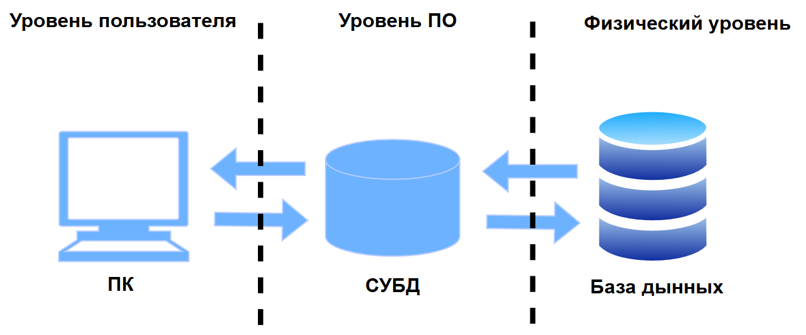
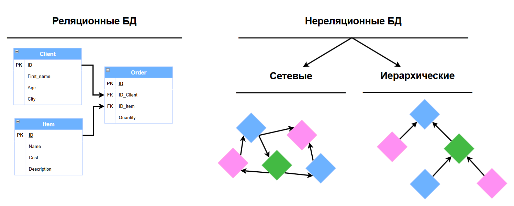

# :sunglasses: Всем HOLAAA!

Меня зовут **Максим Цыганов** и я начинающий специалист в сфере Big Data по направлению **Data Engineering**
Несколько недель назад у меня появилась идея-фикс о том, чтобы не просто сидеть и штудировать тонны материалов по DE в одиночестве, а делать такие кратике пет-проекты (конспекты). Возможно, некоторым понадобятся данные конспекты и я буду рад оказать своё содействие в развитие такого крутого направления как Data Engineering.

P.S. *Я понимаю, что я только начинаю свой путь и буду рад, если более крутые специалисты помогут мне улучшить знания и смогут дополнить информацию приведённую в данном блоке* :)

---

# :thinking: 1.1. Что такое базы данных? 
Начнём разбор с того что собой представляют базы данных[^1] _(далее БД)_ и что это вообще за зверь такой? В одной из первых книг по БД я наткнулся на такую интересную интерпритацию.
[^1]: **Базы данных** (БД) — это стрктурированная совокупность взаимосвязанных данных в некоторой предметной области.
>*«Саму же базу данных можно рассматривать как подобие электронной картотеки, т.е. хранилище или контейнер для некоторого набора файлов данных, занесенных в компьютер.»*  **C.J.Date**

Как по мне это самый приближённый к действительности пример, просто его надо осознать на практике, и приведённая картинка приближённое олицетворение того как раньше выглядили БД в IRL.

 Вам из слов цитаты Дейта стоит запомнить, что это не просто хранилища или контейнеры которые хранят некоторый набор файлов, а именно <ins>хранилища или контейнеры в компьютере</ins>. Если вы когда то изучали проектирование информационных систем (специализации 09.03.03 привет!) то вы бы знали что система начала свой путь не с копьютеров а намного раньше, как и БД, ведь обычная картотека так-то тоже может являтся базой хранения некоторых данных.
 Вот вам простая аналогия чтобы было понятно:
>**карточка** из картотеки = **таблице** в БД

 

# :robot: 1.1. Что такое Система Управления Базами Данных (СУБД)?
До этого мы рассмотрели картотеку с её карточками или же таблицами, ну а теперь рассмотрим того кто всем этим управляет, **Архивариуса** или же СУБД[^2]. 

[^2]: **Система управления базами данных** (СУБД) — это программное обеспечение, с помощью которого можно создавать, хранить, изменять и анализировать данные в БД.

Хочу отметить, что я не особо хочу углублятся в уровни на которых то или иное находится, но тут это стоит сделать и снова мне поможет Дейт.
>*«Между собственно **физической базой данных** (т.е. данными, которые реально хранятся на компьютере) **и пользователями системы** располагается уровень **программного обеспечения**, который можно называть по-разному: диспетчер базы данных (database manager), сервер базы данных (database server) или, что более привычно, система управления базами данных, СУБД»* **C.J.Date**

Данное пояснение про то на каком уровне располагается СУБД очень важно для понимания дальнейшей реализации представлений данных :shushing_face:

Самое главное что надо понимать, СУБД такой своеобразный альфа-хищник и его территория это уровень ПО, то есть посылая запрос на языке запросов SQL, СУБД как бы перехватывает его и начинает обрабатывать в ходе чего фактом выполнения становятся полученные данны.

 

# :star: 1.2. Виды БД
Наконец мы дошли до одной из спорных тем виды бд. Я хотел бы рассмотреть основные виды БД и чем они отличаются друг от друга. Если говорить скупо то основных видов всего два:
+ Реляционные
+ Нереляционные 

Если кратко то Реляционная модель основанна на представление данных в виде таблиц, а нереляционная это все остальные виды. Краткое перечесление видов:

1. Реляционные базы данных
   - PostgreSQL
   - MySQL
   - Oracle Database
   - Microsoft SQL Server
   - IBM Db2
   - SQLite
 

п

 

2. Нереляционные базы данных (NoSQL)
   - Документные
     - MongoDB
     - Couchbase
     - Amazon DocumentDB
     - Firebase Firestore
   - Колоночные (Column-family)
     - Apache Cassandra
     - Apache HBase
     - Google BigTable
     - ClickHouse
   - Графовые
     - Neo4j
     - Amazon Neptune
     - ArangoDB
     - JanusGraph
   - Ключ-значение
     - Redis
     - Amazon DynamoDB
     - etcd
     - Riak
 

п

 

3. Иерархические базы данных
   - IBM IMS (Information Management System)
   - Windows Registry
   - XML-базы данных
   - LDAP-серверы
 

п

 

4. Сетевые базы данных
   - CA IDMS (Computer Associates IDMS)
   - Oracle CODASYL DBMS
   - Raima Database Manager
   - TurboIMAGE
 

п

 

5. Объектно-ориентированные базы данных
   - ObjectStore
   - Versant Object Database
   - db4o
   - InterSystems Caché
 

п

 

6. Многомодельные базы данных (поддерживают несколько моделей)
   - ArangoDB (документная, графовая, ключ-значение)
   - Microsoft Azure Cosmos DB (документная, графовая, ключ-значение, колоночная)
   - OrientDB (документная, графовая, объектная)
   - Couchbase (документная, ключ-значение)
 

п

 

Скорее всего вы сильно испугались увидев такое большой список, но реальность немного спокойнее и реальных их всего несколько видов.

 

# :classical_building: 1.1. Свойства ACID

 

# :knot: 1.1. Связи между таблицами (Реляционная модель)

