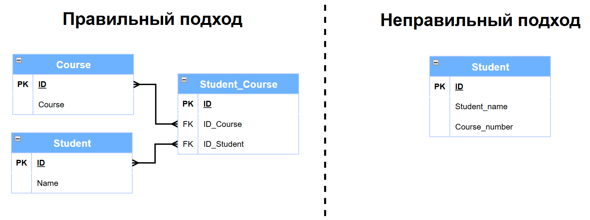

# :sunglasses: Всем HOLAAA!

Меня зовут **Максим Цыганов** и я начинающий специалист в сфере Big Data по направлению **Data Engineering**
Несколько недель назад у меня появилась идея-фикс о том, чтобы не просто сидеть и штудировать тонны материалов по DE в одиночестве, а делать такие кратике пет-проекты (конспекты). Возможно, некоторым понадобятся данные конспекты и я буду рад оказать своё содействие в развитие такого крутого направления как Data Engineering.

P.S. *Я понимаю, что я только начинаю свой путь и буду рад, если более крутые специалисты помогут мне улучшить знания и смогут дополнить информацию приведённую в данном блоке* :)

---

# :thinking: 1.1. Что такое базы данных? 
Начнём разбор с того что собой представляют базы данных[^1] _(далее БД)_ и что это вообще за зверь такой? В одной из первых книг по БД я наткнулся на такую интересную интерпритацию.
[^1]: **Базы данных** (БД) — это стрктурированная совокупность взаимосвязанных данных в некоторой предметной области.
>*«Саму же базу данных можно рассматривать как подобие электронной картотеки, т.е. хранилище или контейнер для некоторого набора файлов данных, занесенных в компьютер.»*  **C.J.Date**
<br>


Как по мне это самый приближённый к действительности пример, просто его надо осознать на практике, и приведённая картинка приближённое олицетворение того как раньше выглядили БД в IRL.

 Вам из слов цитаты Дейта стоит запомнить, что это не просто хранилища или контейнеры которые хранят некоторый набор файлов, а именно <ins>хранилища или контейнеры в компьютере</ins>. Если вы когда то изучали проектирование информационных систем (специализации 09.03.03 привет!) то вы бы знали что система начала свой путь не с копьютеров а намного раньше, как и БД, ведь обычная картотека так-то тоже может являтся базой хранения некоторых данных.
 Вот вам простая аналогия чтобы было понятно:
>**карточка** из картотеки = **таблице** в БД

<br>

# :robot: 1.2. Что такое Система Управления Базами Данных (СУБД)?
До этого мы рассмотрели картотеку с её карточками или же таблицами, ну а теперь рассмотрим того кто всем этим управляет, **Архивариуса** или же СУБД[^2]. 

[^2]: **Система управления базами данных** (СУБД) — это программное обеспечение, с помощью которого можно создавать, хранить, изменять и анализировать данные в БД.

Хочу отметить, что я не особо хочу углублятся в уровни на которых то или иное находится, но тут это стоит сделать и снова мне поможет Дейт.
>*«Между собственно **физической базой данных** (т.е. данными, которые реально хранятся на компьютере) **и пользователями системы** располагается уровень **программного обеспечения**, который можно называть по-разному: диспетчер базы данных (database manager), сервер базы данных (database server) или, что более привычно, система управления базами данных, СУБД»* **C.J.Date**


Данное пояснение про то на каком уровне располагается СУБД очень важно для понимания дальнейшей реализации представлений данных :shushing_face:

Самое главное что надо понимать, СУБД такой своеобразный альфа-хищник и его территория это уровень ПО, то есть посылая запрос на языке запросов SQL, СУБД перехватывает его и начинает обрабатывать в ходе чего фактом выполнения становятся полученные данны или выполненая операция.

<br>

# :star: 1.3. Виды БД
Наконец мы дошли до одной из спорных тем виды бд. Я хотел бы рассмотреть основные виды БД и чем они отличаются друг от друга. Если говорить скупо то основных видов всего два:
+ Реляционные
+ Нереляционные 

Если кратко то Реляционная модель основанна на представление данных в виде таблиц, а нереляционная это все остальные виды. Так же реляционные БД называют SQL, а нереляционные как NoSQL, подобное название связанно с тем, что NoSQL появился как отрицание подходов SQL. Так же стоит скахать что ещё один новый подход который называется NewSQL он объеденяет SQL и NoSQL, но в данной работе я хочу углубится в основы SQL.


А если всё же вдоваться в подробности этиъ видов огромное количество, в частности ниже я привёл таблицу с перечеслением видо БД, их описаниеми и представителячми. 

### Типы баз данных: классификация и представители

| Вид | Описание | Представители |
|-----|----------|---------------|
| **Реляционные (SQL)** | Таблицы со строками и столбцами, связанные через ключи *(Используют язык SQL)* | <ul><li>PostgreSQL</li><li>MySQL</li><li>Oracle Database</li><li>Microsoft SQL Server</li><li>IBM Db2</li><li>SQLite</li><li>MariaDB</li><li>Amazon Aurora</li></ul> |
| **Документные (NoSQL)** | Хранение данных в формате документов (JSON/BSON) с гибкой схемой | <ul><li>MongoDB</li><li>Couchbase</li><li>Amazon DocumentDB</li><li>Firebase Firestore</li><li>RavenDB</li><li>Azure Cosmos DB (Document API)</li></ul> |
| **Колоночные (Column-family)** | Хранение данных по колонкам, а не по строкам, для аналитических запросов | <ul><li>Apache Cassandra</li><li>Apache HBase</li><li>Google BigTable</li><li>ClickHouse</li><li>ScyllaDB</li><li>Amazon Keyspaces</li></ul> |
| **Графовые** | Узлы (сущности) и ребра (связи) для работы с взаимосвязанными данными | <ul><li>Neo4j</li><li>Amazon Neptune</li><li>ArangoDB</li><li>JanusGraph</li><li>TigerGraph</li><li>OrientDB</li></ul> |
| **Ключ-значение (Key-Value)** | Простая структура "ключ → значение" для быстрого доступа | <ul><li>Redis</li><li>Amazon DynamoDB</li><li>etcd</li><li>Riak</li><li>Berkeley DB</li><li>Memcached</li></ul> |
| **Иерархические** | Древовидная структура данных с родительско-дочерними отношениями | <ul><li>IBM IMS</li><li>Windows Registry</li><li>XML-базы данных</li><li>LDAP-серверы</li><li>eXist-db</li><li>BaseX</li></ul> |
| **Сетевые** | Расширение иерархической модели с поддержкой нескольких родителей | <ul><li>CA IDMS</li><li>Oracle CODASYL DBMS</li><li>Raima Database Manager</li><li>TurboIMAGE</li><li>Univac DMS-1100</li></ul> |
| **Объектно-ориентированные** | Хранение объектов с методами, классами и наследованием | <ul><li>ObjectStore</li><li>Versant Object Database</li><li>db4o</li><li>InterSystems Caché</li><li>GemStone/S</li><li>Objectivity/DB</li></ul> |
| **Многомодельные** | Поддержка нескольких моделей данных в одной системе | <ul><li>ArangoDB</li><li>Microsoft Azure Cosmos DB</li><li>OrientDB</li><li>MarkLogic</li><li>Couchbase</li><li>DataStax Enterprise</li></ul> |
| **Временные/Time-Series** | Оптимизированы для хранения временных рядов данных | <ul><li>InfluxDB</li><li>TimescaleDB</li><li>Prometheus</li><li>OpenTSDB</li><li>QuestDB</li><li>TDengine</li></ul> |
| **Поисковые/Search Engine** | Специализированные для полнотекстового поиска | <ul><li>Elasticsearch</li><li>Apache Solr</li><li>Algolia</li><li>MeiliSearch</li><li>Typesense</li><li>OpenSearch</li></ul> |
| **Векторные** | Для хранения векторных эмбеддингов и семантического поиска | <ul><li>Pinecone</li><li>Weaviate</li><li>Qdrant</li><li>Milvus</li><li>Chroma</li><li>pgvector (расширение PostgreSQL)</li></ul> |

<br>

Скорее всего вы сильно испугались увидев такую большую таблицу, но поверьте освоив одну из вида, вы сможете освоить многие другие, они отличаются лишь на программном уровне и в уровне хранения и размерности.


<br>


# :balance_scale: 1.4. ACID, BASE и CAP: Фундаментальные компромиссы распределённых систем

Сегодня сложно говорить про разработку без включения туда облачных технологий, глобальной сети интернет, огромного количества микросервисов и разных ново-модных технологических новшеств. Но за всей этой красивой модной картинкой IT-специалиста с кофе в руках, стоит два фундаментальных понятия и одна теорема.


## :european_castle: ACID: Классическая крепость

**ACID** – это четыре столпа надежности, на которых десятилетиями строились монолитные приложения и традиционные базы данных.

| Принцип | Суть | Простая аналогия |
|---------|------|------------------|
| **Атомарность** | "Всё или ничего" – операция либо выполняется полностью, либо откатывается | Перевод денег: либо списание И зачисление, либо ничего |
| **Согласованность** | Данные всегда в корректном состоянии после транзакции | Баланс не уйдёт в минус, email останется уникальным |
| **Изолированность** | Транзакции не мешают друг другу, не видят "грязных" данных | Два кассира не продадут последний билет одновременно |
| **Долговечность** | Если система сказала "успех" – данные переживут сбой | Запись сохранится даже при отключении электричества |

<br>

**ACID – это прекрасно. Это как сейф для данных.** Но попробуйте растянуть этот сейф на несколько серверов:
```sql
-- В монолите: быстро и надёжно
BEGIN TRANSACTION;
  UPDATE accounts SET balance = balance - 100 WHERE user_id = 1;
  UPDATE accounts SET balance = balance + 100 WHERE user_id = 2;
COMMIT; -- ACID гарантирован

-- В распределённой системе:
-- Сервер 1 в Нью-Йорке
-- Сервер 2 в Лондоне  
-- Сеть между ними "моргает"...
-- Как гарантировать ACID?
```


**Проблема:** Протоколы вроде двухфазного коммита (2PC) пытаются обеспечить распределённый ACID, но требуют координатора и блокировок на всех узлах. Если один узел "задумался" – весь процесс встаёт. 
> **Цена за строгий ACID в распределёнке – падение производительности и доступности.**

<br>

## :arrows_counterclockwise: BASE: Прагматизм в мире несовершенства

Когда строгие гарантии ACID становятся слишком дорогими для распределённых систем, появляется альтернативная философия — **BASE**. Это не жёсткий стандарт, а набор принципов, описывающих прагматичный подход к проектированию систем, которые должны работать в условиях частичных отказов и неполной согласованности.

### Три принципа BASE:

| Принцип | Суть | Пример из жизни |
|---------|------|-----------------|
| **B**asically Available<br>*(Базовая доступность)* | Система делает всё возможное, чтобы оставаться доступной для запросов, даже если это означает работу с неполными или устаревшими данными | Соцсеть продолжает работать, даже если счётчики лайков обновляются с задержкой в несколько секунд |
| **S**oft State<br>*(Гибкое состояние)* | Состояние системы может меняться со временем без прямого внешнего воздействия — из-за фоновых процессов синхронизации | Кэш постепенно устаревает, реплики данных синхронизируются асинхронно, счётчики "догоняют" реальность |
| **E**ventually Consistent<br>*(Согласованность в конечном счёте)* | Если новые изменения в определённый фрагмент данных прекратятся, то рано или поздно все узлы придут к одному состоянию | Ваш комментарий в соцсети появится у всех подписчиков — возможно, не мгновенно, но обязательно |

### Почему BASE, а не ACID?

**BASE признаёт простую истину**: во многих реальных сценариях абсолютная немедленная согласованность — это излишняя роскошь, за которую приходится платить доступностью и производительностью.

**Пример: система комментариев в социальной сети**

```python
def add_comment(post_id, comment, user_id):
    # 1. Быстрая локальная запись (Availability)
    # Не ждём подтверждения от других узлов
    local_storage.save_comment(post_id, comment, user_id)
    
    # 2. Асинхронная репликация (Eventual Consistency)
    # Отправляем в очередь, система разберётся когда сможет
    message_queue.publish({
        'type': 'new_comment',
        'post_id': post_id,
        'comment': comment,
        'user_id': user_id,
        'timestamp': time.time()
    })
    
    # 3. Немедленный ответ пользователю
    # Он видит свой комментарий сразу
    return {
        'status': 'success',
        'comment_id': generate_id(),
        'message': 'Комментарий опубликован'
    }

# Что происходит дальше:
# 1. Очередь сообщений доставляет информацию о комментарии другим узлам
# 2. Каждый узел применяет изменение, когда до него дойдёт очередь
# 3. Через несколько секунд все узлы видят один и тот же комментарий
```
Где использовать BASE:
+ Социальные сети (лайки, комментарии)
+ Системы рекомендаций
+ Аналитика в реальном времени
+ Кэширование

<br>

## ⚡ Теорема CAP: Жёсткая реальность распределёнки

К большому сожалению сеть будет 'моргать', и с этим надо жить. Когда происходит сетевое разделение, система должна пожертвовать либо Согласованностью, либо Доступностью. Нельзя иметь и то, и другое одновременно."

Теорема CAP объясняет фундаментальные ограничения распределённых систем через три свойства:

| Свойство | Что значит в контексте CAP |
|----------|----------------------------|
| **C**onsistency (Согласованность) | Все узлы видят одни и те же данные в один момент времени |
| **A**vailability (Доступность) | Каждый запрос получает ответ (не обязательно с актуальными данными) |
| **P**artition tolerance (Устойчивость к разделению) | Система работает при разрыве связи между узлами |

**Главный вывод CAP:** P (разделение сети) *неизбежно* → придётся выбирать между C и A

### Три стратегии:

**1. CP (Consistency over Availability)** 
> *"Лучше молчать, чем врать"*

- **Пример**: Банковские переводы, медицинские системы
- **Поведение при разделе**: Если узел не может гарантировать актуальность данных – он не отвечает
- **Технологии**: PostgreSQL (в кластере), MongoDB с strict write concern, HBase

```javascript
// Жёсткая настройка на согласованность в MongoDB
db.orders.insert(order, {
  writeConcern: { w: "majority", j: true } // Пишем в большинство, ждём подтверждения на диск
});
// При разделе сети запись может зависнуть или вернуть ошибку
```

**2. AP (Availability over Consistency)**
> *"Лучше показать вчерашние новости, чем показать ошибку 500"*

- **Пример:** Социальные сети, кэши, рекомендательные системы
- **Поведение при разделе:** Узлы продолжают работать, но данные могут расходиться
- **Технологии:** Cassandra, DynamoDB, Redis (по умолчанию)

```sql
-- Настройка на доступность в Cassandra
CONSISTENCY ONE; -- Чтение/запись в один узел (быстро!)
-- При разделе: разные пользователи видят разное количество лайков
-- Но система всегда отвечает
```

**3. CA (Consistency + Availability)**
> ***"Идеальный мир без сетевых проблем"*** **- существует только в теории. Как только случается P, любая CA-система становится CP или AP.**

## Итоги по ACID VS BASE

### 🎯 Когда выбирать ACID?

| Ситуация | Почему ACID | Пример |
|----------|-------------|--------|
| **Финансовые операции** | Нельзя допустить потерю или дублирование денег | Банковские переводы, платежи, биллинг |
| **Транзакционные системы** | Гарантии целостности данных критически важны | Интернет-магазины (заказы), системы бронирования |
| **Данные с чёткими связями** | Сложные связи между таблицами должны быть согласованны | CRM, ERP системы, учётные системы |
| **Регуляторные требования** | Закон требует строгой отчётности и аудита | Медицинские записи, налоговые системы |
| **Системы с критичными данными** | Ошибка в данных может привести к серьёзным последствиям | Авиадиспетчерские системы, энергетика |

<Br>

### 🎯 Когда выбирать BASE?

| Ситуация | Почему BASE | Пример |
|----------|-------------|--------|
| **Высокие требования к доступности** | Система должна отвечать всегда, даже если данные не самые свежие | API социальной сети, поиск товаров |
| **Массовые операции записи** | Тысячи операций в секунду | Логирование, метрики, clickstream |
| **Геораспределённость** | Пользователи по всему миру | Глобальные сервисы (YouTube, Twitter) |
| **Временная рассинхронизация допустима** | Можно показать "примерные" данные | Счётчики просмотров, лайки, комментарии |

<br>

И вот подводя итог по такой объёмной теме, я хотел бы сказать, что выбор зависит от поставленной задачи (проблемы), ведь как и любой другой инструмент в IT, ACID и BASE призваны решать проблемы а не быть пятой ногой у собаки. Не стоит думать что тут есть идеальный вариант для решения всех задач. Мой совет вам поймити что заложено внутри CAP и тогда выбор ACID или BASE станет для вас очевиден.

<br>

# :knot: 1.5. Связи между таблицами (Реляционная модель) 
**Связи между таблицами** — это основа реляционной модели данных. Они определяют, как данные в разных таблицах связаны между собой, позволяют избежать дублирования информации и обеспечивают целостность данных.

## **Так что же такое связи и зачем они нужны?**

Представьте себе, что вы ведёте учёт обучающихся в университет и вам надо записывать **имя** обучающегося и его **курс** *(предметы)*. И тут вы можете сказать сделать таблицу студентов где мы укажем имя и курс, но нет. Такой подход является неправильным и ниже на рисунке я привёл пример правильно подхода.



Так зачем же вообще надо разбивать? А всё очень просто, когда при неправильном подходе вы будете всё заполнять у вас будет студент на сотнях курсов и это создаст **избыточность данных**. У вас постоянно будет повторятся *имя* и *название кусра*.

По правде говоря тут проблема намного глубже, как и ACID, и всё дело в кодировке и размерности хранимой информации а точнее как она заполняется, пример:

Строковые поля (*Course_name*, *Student_name*) в каждой строке — это повторяющиеся **VARCHAR**. Вместо хранения **ID** (*4 байта* ***int***) хранится полное имя студента (допустим, 30 байт в UTF-8). Для 10 000 записей:

`Иванов Иван Иваноич` — ~40 байта (20 символов × 2 байта в UTF-8 для кириллицы), по хорошему ещё служебную информацию докинуть, но там всё от **СУБД** зависет, ну к прмиеру я докинут 2 байта. Итого у нас получается:
### **10 000×42 байт = 420 000 байт (≈410 КБ)**
> *И это только для 10 000 студентов... по опыту работы скажу, что студентов в университете намного больше* :frowning_face:

В это же время как хранение через ID будет куда выгоднее и вот почему. В таблице Students одно имя хранится 1 раз = 42 байта. В таблице связей Student_Course для 10 000 связей используется ID студента *(**INT**, 4 байта)*, :

### **10 000×4 байт = 40 000 байт (≈39 КБ)**

Итоговая разница вам видна наглядно... целые **380 000 байта (≈371 КБ)**, а это мы только ФИО разложили. Но как я уже сказал это лишь одно поле, а представьте если их будет больше. Ниже я приведу "примерный" варинат таблицы студентов *(без учета кучи дицсиплин, учебных планов, расписания сессий, оценок по мероприятиям и т.д и т.п.)*


Как видно из рисунка все данны собираются в общую таблицу *Студенты*, но объём хранимых данных будет совершенно разным а от объёма будет уже прыгать общая нагрузка на БД. Поймите ещё такую вещь, что от нагрузки будет зависеть увидете вы 500 ошибку или нет. Так что делайте круто и не делайте не круто :) 
> *да я понимаю, что раздел больше похож на объяснение нормальных форм* :face_holding_back_tears: )

<br>

## **Связи реляционных таблиц**
А теперь когда я вам объяснил почему связи нужны перейдём к тому,что в реляционных базах данных существует три основных типа связей между таблицами:
- **1:1** *Один-к-одному* 
- **1:М** *Один-ко-многим* 
- **М:М** *Многие-ко-многим* 
> Понимание этих типов — основа проектирования эффективной структуры БД


### Один к одному (1:1)

Одна запись в таблице **А** связана с одной записью в таблице **Б**

Примеры:
- Паспорт ↔ Гражданин *(у человека один паспорт, паспорт принадлежит одному человеку)*
- Пользователь ↔ Настройки профиля *(у пользователя одни настройки)*
- Студент ↔ Студенческий билет

**Реализация на T-SQL:**
```sql
CREATE TABLE Студент (
    ID INT PRIMARY KEY,
    Имя VARCHAR(50)
);

CREATE TABLE Студенческий_билет (
    ID INT PRIMARY KEY,
    Номер_билета VARCHAR(20),
    ID_Студент INT UNIQUE,  -- UNIQUE гарантирует 1:1
    FOREIGN KEY (ID_Студент) REFERENCES Студент(ID)
);
```


Когда использовать:
- Когда часть данных редко используется (выносим в отдельную таблицу для оптимизации)
- Когда данные конфиденциальны (отдельная таблица с доступом по правам)
- Когда объект логически разделён на независимые сущности

<br>

### Один ко многим (1:M)
Одна запись в таблице **А** связана с несколькими записями в таблице **Б**

Примеры:
- Кафедра ↔ Преподаватели (на одной кафедре много преподавателей)
- Группа ↔ Студенты (в одной группе много студентов)
- Заказ ↔ Товары в заказе (в одном заказе много товаров)

**Реализация на T-SQL:**
```sql
CREATE TABLE Группа (
    ID INT PRIMARY KEY,
    Название VARCHAR(20)
);

CREATE TABLE Студент (
    ID INT PRIMARY KEY,
    Имя VARCHAR(50),
    Группа_ID INT,  -- Много студентов могут иметь одну группу
    FOREIGN KEY (ID_Группа) REFERENCES Группа(ID)
);
```


Особенности:
- Самый распространённый тип связи
- Внешний ключ создаётся в таблице со стороной "многие"
- Не требует промежуточной таблицы

<br>

### Многие ко многим (M:M)
Несколько записей в таблице **А** связаны с несколькими записями в таблице **Б**

Примеры:
- Студенты ↔ Дисциплины (студент может посещать несколько дисциплин, на дисциплину записано несколько студентов)
- Книги ↔ Авторы (книга может иметь несколько авторов, автор может написать несколько книг)
- Врачи ↔ Пациенты (врач лечит многих пациентов, пациент посещает многих врачей)

*Требуется промежуточная таблица (junction table, bridge table)*

**Реализация на T-SQL:**
```sql
CREATE TABLE Студент (
    ID INT PRIMARY KEY,
    Имя VARCHAR(50)
);

CREATE TABLE Дисциплина (
    ID INT PRIMARY KEY,
    Название VARCHAR(100)
);

-- Промежуточная таблица
CREATE TABLE Студент_Дисциплина (
    ID INT PRIMARY KEY,
    ID_Студент INT,
    ID_Дисциплина INT,
    Дата_записи DATE,
    Оценка INT,
    FOREIGN KEY (ID_Студент) REFERENCES Студент(ID),
    FOREIGN KEY (ID_Дисциплина) REFERENCES Дисциплина(ID)
);
```


Особенности промежуточной таблицы:
- Содержит минимум два внешних ключа
- Может содержать дополнительные данные (дата записи, оценка, статус)
- Первичный ключ часто составной (Студент_ID, Дисциплина_ID)

<br>

# Итоги разделов:
Надеюсь после прочтения данной статьи вам стало немного понятно что такое БД и как они работают. Я понимаю, что мало уделил такому понятию как СУБД, но я не вижу смысла разбирать его столь досконально на нчальных этапах, как по мне это лишний раз забьёт голову. Так же хочу отметить, что постарался максимально подробно объяснить почему таблицы приводят к тому или не к иному другому виду на примерах. Расписал несколько таблицы на T-SQL и представил картинки чтобы было более понятно, что и где в коде находится, но код я хочу разобрать в следующем разделе.

> *Эти труды я делаю для людей, и понимаю, что в общей массе многим DE они покажутся банальными и не нужными, но я лишь хочу помочь в изучение и понимание для людей у которых горят глаза.*

Если вам, кажется, что я что-то упустил, то пожалуйста отпишите мне на почту, я обязательно прочитаю и постараюсь масимально качественно обновить статью: 
**aepivxfi26ga@list.ru**
 


