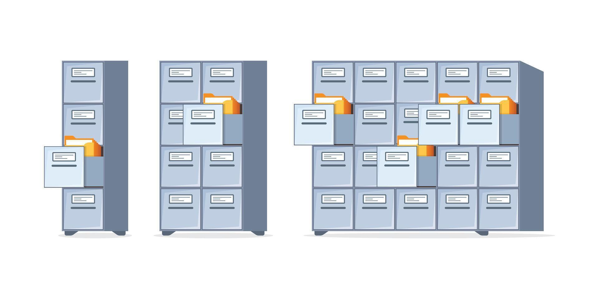

# Всем HOLAAA! :sunglasses:

Меня зовут **Максим Цыганов** и я начинающий специалист в сфере Big Data по направлению **Data Engineering**
Несколько недель назад у меня появилась идея-фикс о том, чтобы не просто сидеть и штудировать тонны материалов по DE в одиночестве, а делать такие кратике пет-проекты (конспекты). Возможно, некоторым понадобятся данные конспекты и я буду рад оказать своё содействие в развитие такого крутого направления как Data Engineering.

P.S. *Я понимаю, что я только начинаю свой путь и буду рад, если более крутые специалисты помогут мне улучшить знания и смогут дополнить информацию приведённую в данном блоке* :)

---

# :thinking: Что такое базы данных? 
Начнём разбор с того что собой представляют базы данных _(далее БД)_ и что это вообще за зверь такой? В одной из первых книг по БД я наткнулся на такую интересную интерпритацию.
>*«Саму же базу данных можно рассматривать как подобие электронной картотеки, т.е. хранилище или контейнер для некоторого набора файлов данных, занесенных в компьютер.»*  **C.J.Date**

Как по мне это самый приближённый к действительности пример, просто его надо осознать на практике, и приведённая картинка приближённое олицетворение того как раньше выглядили БД в IRL.

 Вам из слов цитаты Дейта стоит запомнить, что это не просто хранилище или контенейр который хранят некоторый набор файлов, а именно <ins>хранилище или контенейр в компьютере</ins>. Если вы когда то изучали проектирование информационных систем (специализации 09.03.03 привет!) то вы бы знали что система начала свой путь не с копьютеров а намного раньше, как и БД, ведь обычная картотека так-то тоже может являтся базой хранения некоторых данных.
 Надеюсь такую простую аналогию что карточка из картотеки = таблице в БД :)

